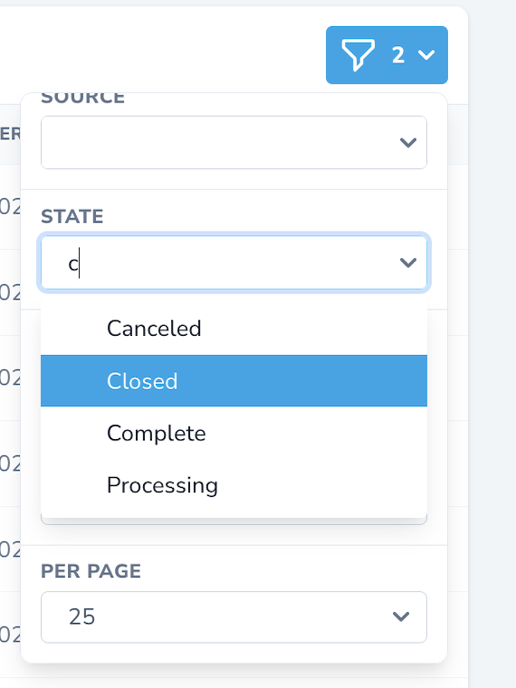

# Nova Combobox Filter

This component is based on the [Headless UI Combobox component](https://headlessui.dev/vue/combobox) and adds a multiselect filter to Laravel Nova. 

## Requirements
- `php: >=7.2`
- `laravel/nova: ^4.0`

## Installation

Install via Composer:

`composer require harrald/nova-combobox-filter`

## Screenshots

## Credits

This package was inspired by [optimistdigital/nova-multiselect-filter](https://github.com/optimistdigital/nova-multiselect-filter)

## License

This project is open-sourced software licensed under the MIT license.
